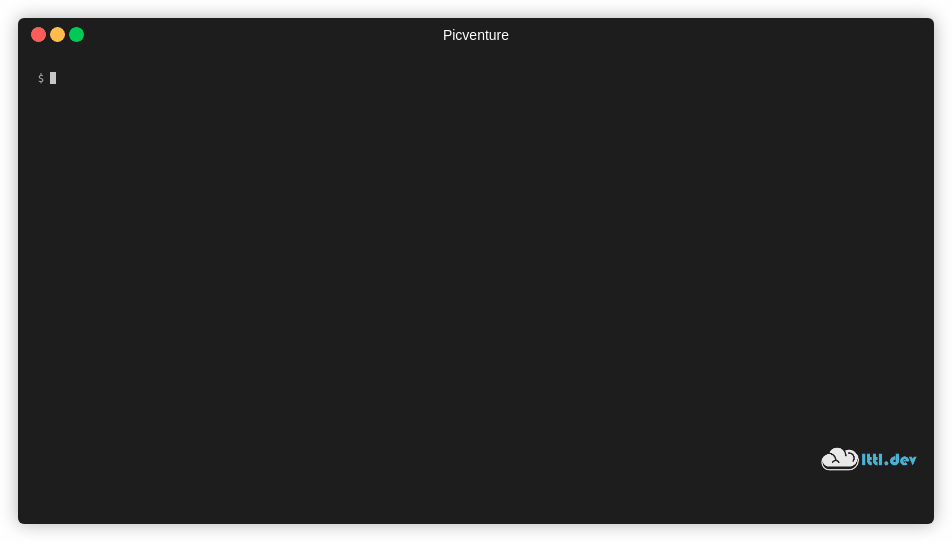

# Picventure

The RPG text adventure project from under [raspberrypi.org](https://projects.raspberrypi.org/en/projects/rpg) implemented in Go for educational purposes. It features colors (on the terminal) and game pictures (on a Sense HAT). The latter is locally exposed as a "web service" (called "picservice") and loosely coupled to the game implementation. The idea is to also demo microservices to kids.

## Environments

Developed on a [Raspberry Pi 400](https://www.raspberrypi.org/products/raspberry-pi-400/):

```bash
$ uname -a
Linux raspi400 5.8.0-1010-raspi #13-Ubuntu SMP PREEMPT Wed Dec 9 17:14:07 UTC 2020 aarch64 aarch64 aarch64 GNU/Linux
$ go version
go version go1.14.7 linux/arm64
```

Also tested on a Lenovo ThinkPad X250:

```bash
$ uname -a
Linux x250 4.15.0-128-generic #131-Ubuntu SMP Wed Dec 9 06:57:35 UTC 2020 x86_64 x86_64 x86_64 GNU/Linux
$ go version
go version go1.15.6 linux/amd64
```

## Make

```bash
$ make
usage: make <target>

  where <target> is one of the following

    all         to run all on both, picservice and rpg

    help        to show this text
```

```bash
$ make all
# ...
```

## Play

### Start picservice

Open a shell in this directory, then:

```bash
$ cd picservice && GIN_MODE=release ./picservice
INFO[0000] picservice start...
```

### Start picventure

Open a separate shell in this directory, then:

```bash
$ cd rpg && ./picventure 
Picventure - A colorful RPG adventure (with optional pictures)
==============================================================

Get to the Garden with a key and a potion
Avoid the monsters!

Commands:
  go "direction"    (where "direction" is one of the following: north, east, south, west)
  get "item"
  exit
---------------------------
You are in the Hall
You see a key
Inventory:
---------------------------
> 
```

## Demo

**Spoiler alert!**



When you encounter an item or finish the game, the corresponding picture appears on the Sense HAT:


([from Trinket and the Raspberry Pi Foundation](https://trinket.io/sense-hat))

## Originals

- [Python source](https://rpf.io/rpg-code)
- [Game map](https://projects-static.raspberrypi.org/projects/rpg/31fb9012c6d897ad16f2f245fb4791b6384cda28/en/images/rpg-final-map.png)

## To do/Open

- remove terminalizer
- map (cheatsheet)
- add tests
- introduce [enums](https://www.ribice.ba/golang-enums/)
- introduce constants
- improve `inventory.Contains` check
- `input = strings.TrimRight`?

## Ideas

- save/load game
- 3 dimensions: up/down via stairs
- find/get a random item (like an in-app purchase)
- add-on: visualization of position
